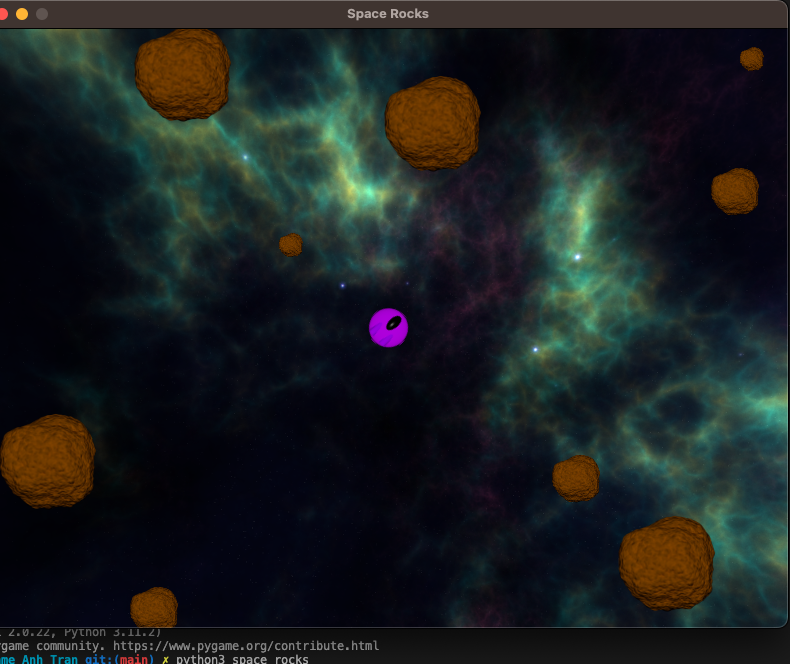

# <a href="https://realpython.com/certificates/cbeb09dc-2b30-4e15-9e8c-360b311765f6/">Using Pygame to Build an Asteroids Game in Python on Real Python</a>

A classic space invaders game made in Python using Pygame.

## Learning Goals
Things that I have learned and kept working on this projects
- Pygame 
- Object-Oriented Programming

## Game Screenshot 

  

## Game Rules:
- Player have one live
- When rock hit a ship, Player will lose.
- Player's ship can only move along the space in a fixed speed by pressing ARROW_LEFT & ARROW_RIGHT keys

## Set-up:
- Clone GitHub repository
- Install Pygame: pip install pygame
- Run: python3 game.py

## Connect with me!

  

## Email Me :e-mail:

